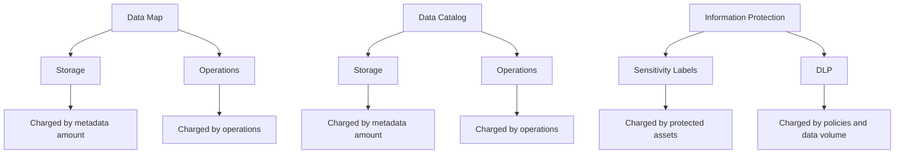

# Purview for Fabric - Overview 

Costa Rica

 

[brown9804](https://github.com/brown9804)

Last updated: 2025-03-21

----------

<b>List of References </b> (Click to expand)

- [Use Microsoft Purview to govern Microsoft Fabric](https://learn.microsoft.com/en-us/fabric/governance/microsoft-purview-fabric)
- [The Microsoft Purview hub for data owners (preview)](https://learn.microsoft.com/en-us/fabric/governance/use-microsoft-purview-hub-data-owners)
- [Govern data in Microsoft Fabric with Purview](https://learn.microsoft.com/en-us/training/modules/fabric-data-governance-purview/)

## Content

- [Purview + Fabric](#purview--fabric)
- [Microsoft Purview Pricing: Fabric focused](#microsoft-purview-pricing-fabric-focused)
- [Cost Optimization Strategies](#cost-optimization-strategies)

## Purview + Fabric 

> Microsoft Purview and Microsoft Fabric are integrated to provide a comprehensive `data governance and analytics platform`.
> Purview enables users to `discover, classify, and protect data within Fabric`, ensuring that `data governance policies are consistently applied across the entire data estate`.
> Purview's capabilities, such as `automated scanning, ingestion, classification, and sensitivity labeling, enhance the governance of Fabric's data assets, providing a unified approach to data management and compliance`.

| Feature | Description | Free | Charged | Interaction |
|---------|-------------|------|---------|-------------|
| **Automated Scanning, Ingestion & Classification** | This feature involves scanning and classifying data assets within Fabric. It helps in identifying and categorizing data based on predefined rules and policies. | - **Power BI Online**: Free for a limited time means that users can utilize automated scanning, ingestion, and classification features for Power BI Online without incurring costs during the promotional period.  - **SQL Server on-prem**: Free for a limited time indicates that users can use automated scanning, ingestion, and classification features for SQL Server on-premises without charges during the promotional period | **Other data sources**: $0.011 per vCore minute | Interacts with **Data Map Enrichment** by providing initial metadata. Feeds into **Report Generation** by supplying data for reports. |
| **Data Map Enrichment** | Enriching metadata with advanced resource sets involves adding detailed information to the metadata, making it more useful for data governance and analysis. | N/A | $0.21 per vCore-hour | Enhances metadata from **Automated Scanning, Ingestion & Classification**. Used in **Report Generation** for detailed insights. |
| **Report Generation** | Generating reports based on scanned data provides insights and summaries of the data assets, helping in decision-making and compliance monitoring. | N/A | $0.82 per vCore-hour | Utilizes enriched metadata from **Data Map Enrichment** to create comprehensive reports. |
| **Elastic Data Map** | Capacity units support data map operations and metadata storage, allowing for scalable and efficient management of data assets. | N/A | $0.411 per capacity unit hour | Supports operations of **Automated Scanning, Ingestion & Classification**, **Data Map Enrichment**, and **Report Generation**. |
| **Data Catalog** | Browsing and searching data assets allows users to explore and find relevant data within Fabric. This feature is included with the Data Map. | Included with Data Map | N/A | Leverages metadata and insights from other features for a unified view of data. |
| **Data Policy** | Applying DevOps policies to data assets involves setting rules and policies for data management and governance. | N/A | $0.0027 per policy hour | Ensures compliance and proper data management for assets managed by other features. |
| **Insights Consumption** | API calls for insights and data access allow users to retrieve and interact with data programmatically, providing flexibility in data usage. | N/A | $0.21 per API call | Enables programmatic access to data and metadata managed by other features. |

## Microsoft Purview Pricing: Fabric focused

> When Purview is integrated with Fabric, the following aspects are considered for pricing:

> [!TIP]
> `Compute resources` are used for `operations` such as scanning, ingestion, classification, enrichment, and report generation. These operations involve processing data and performing various tasks that require computational power.	  
> `Storage resources` are used to `store metadata`, data maps, and other related information. This includes the storage of scanned metadata, enriched metadata, and generated reports.	

| Aspect | Description | Pricing |
|--------|-------------|---------|
| **Unified Data Catalog** | **Metadata Management**: Purview captures metadata from Fabric items. | Cost is based on the amount of metadata stored and the operations performed. |
| **Information Protection** | **Sensitivity Labels**: Applying sensitivity labels to Fabric items. | Charges are based on the number of assets protected. |
| **Data Governance** | **Data Map Operations**: Scanning and cataloging Fabric data assets in Purview. | Charged based on the number of operations performed. |

> Pricing example:   
> 1. **Automated Scanning, Ingestion & Classification**: **Other data sources**: 0.5 minutes of total scan duration using 16 vCores.   
> 2. **Data Map Enrichment**: 365 hours of advanced resource set usage.   
> 3. **Report Generation**: 365 hours of report generation.  
> 4. **Elastic Data Map**: 1 capacity units used for 365 hours. `1 Capacity Unit supports requests of up to 25 data map operations per second and includes storage of up to 10 GB of metadata about data assets`    
> 5. **Data Catalog**: Included with the Data Map.   
> 6. **Data Policy**: 0 DevOps policies applied.   
> 7. **Insights Consumption**: 0 API calls.

| Feature | Description | Usage | Rate | Cost |
|---------|-------------|-------|------|------|
| **Automated Scanning, Ingestion & Classification** | Scanning and classifying data assets within Fabric. | 0.5 minutes x 16 vCores | $0.011 per vCore minute | $0.09 |
| **Data Map Enrichment** | Enriching metadata with advanced resource sets. | 365 hours | $0.21 per vCore-hour | $76.65 |
| **Report Generation** | Generating reports based on scanned data. | 365 hours | $0.82 per vCore-hour | $299.30 |
| **Elastic Data Map** | Capacity units supporting data map operations and metadata storage. | 1 capacity units x 365 hours | $0.411 per capacity unit hour | $150.02 |
| **Data Catalog** | Browsing and searching data assets. | Included with Data Map | N/A | $0.00 |
| **Data Policy** | Applying DevOps policies to data assets. | 0 policies x 365 hours | $0.0027 per policy hour | $0.00 |
| **Insights Consumption** | API calls for insights and data access. | 0 API calls | $0.21 per API call | $0.00 |

> Total Optimized Monthly Cost: 
- **Automated Scanning and Classification**: $0.09
- **Data Map Enrichment**: $76.65
- **Report Generation**: $299.30
- **Elastic Data Map**: $150.02
- **Data Policy**: $0.00
- **Insights Consumption**: $0.00
- **Total Optimized Monthly Cost**: $526.05

> [!NOTE]
> Viewing reports generated by Microsoft Purview within Microsoft Fabric does not incur additional charges. The costs are primarily associated with the generation of the reports, which involves processing and computing resources. Once the reports are generated, viewing them is typically free of charge.

## Cost Optimization Strategies

| Strategy | Description | Details |
|----------|-------------|---------|
| **Efficient Scanning and Classification** | Optimize scanning and classification processes to reduce costs. | - **Schedule Scans**: Schedule scans during off-peak hours to reduce costs associated with high-demand periods.  - **Incremental Scans**: Use incremental scans to only scan new or modified data, reducing the total scan duration and vCore usage. |
| **Selective Data Map Enrichment** | Focus on enriching metadata for critical data assets. | - **Prioritize Critical Data**: Focus on enriching metadata for critical data assets that require detailed governance and analysis.  - **Batch Processing**: Process data in batches to optimize resource usage and reduce vCore-hour costs. |
| **Targeted Report Generation** | Limit report generation to essential reports. | - **Generate Essential Reports**: Limit report generation to essential reports that provide the most value for decision-making and compliance monitoring.  - **Optimize Report Frequency**: Adjust the frequency of report generation to balance between timely insights and cost efficiency. |
| **Elastic Data Map Utilization** | Efficiently manage capacity units to optimize costs. | - **Monitor Usage**: Regularly monitor capacity unit usage to ensure efficient allocation and avoid over-provisioning.  - **Scale Appropriately**: Scale capacity units based on actual usage patterns to optimize costs. |
| **API Call Management** | Minimize unnecessary API calls to reduce costs. | - **Optimize API Usage**: Minimize unnecessary API calls by caching results and reusing data where possible.  - **Batch API Requests**: Group API requests to reduce the number of individual calls, optimizing cost per API call. |

  <h3 style="color: #4CAF50;">Total Visitors</h3>
  

