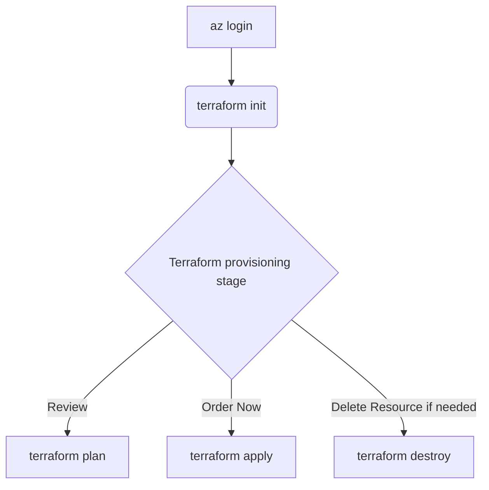

# Demonstration: Deploying Azure Resources for a Data Platform

Costa Rica

[](https://github.com/)
[brown9804](https://github.com/brown9804)

Last updated: 2025-04-21

------------------------------------------

> This repository contains Terraform configurations for setting up Microsoft Fabric Capacity and an SQL Server with a database on a public network, which are basic resources to demo a data platform.
> `Please note, it is important to follow infrastructure as code (IaC) practices to source control the infrastructure, not just the application objects.`
> Here, you can find [additional Terraform templates for different Azure resources across different areas](https://github.com/MicrosoftCloudEssentials-LearningHub/AzureTerraformTemplates-v0.0.0). Feel free to explore and take a look!

> [!TIP]
> About Infrastructure via Terraform, Terraform is an infrastructure as code (IaC) tool that allows you to define and provision your infrastructure using a high-level configuration language. This approach enables source control of the infrastructure itself, allowing you to manage not only the solution code but also the connections and configurations. By using Terraform, you can ensure a consistent and reproducible environment for your deployments, automate infrastructure provisioning, and maintain version control over your infrastructure changes. `Also, Microsoft provides other IaC tools such as Bicep and ARM templates. Bicep is a domain-specific language that uses declarative syntax to deploy Azure resources, offering a concise and easy-to-read alternative to JSON-based ARM templates. ARM templates are JSON files that define the infrastructure and configuration for your Azure solution. These tools provide flexibility and options to suit different preferences and requirements for managing Azure resources.`

<p align="center">
    
</p>

<details>
<summary><b>List of References </b> (Click to expand)</summary>

- [Standard Module Structure](https://developer.hashicorp.com/terraform/language/modules/develop/structure)
- [Microsoft Fabric - Terraform (AzAPI provider) resource definition](https://learn.microsoft.com/en-us/azure/templates/microsoft.fabric/capacities?pivots=deployment-language-terraform)
- [Fabric Terraform Quickstarts](https://github.com/microsoft/fabric-terraform-quickstart/tree/main)

</details>

<details>
<summary><b>Table of Content </b> (Click to expand)</summary>

- [Overview](#overview)
- [Finding admin_principal_id Using Azure CLI](#finding-admin_principal_id-using-azure-cli)
- [Configure Remote Storage for a Terraform deployment](#configure-remote-storage-for-a-terraform-deployment)
- [How to execute it](#how-to-execute-it)

</details>

## Overview

```
.
├── README.md
├── src
├────── main.tf
├────── variables.tf
├────── provider.tf
├────── terraform.tfvars
├────── remote-storage.tf
├────── outputs.tf
```

- main.tf `(Main Terraform configuration file)`: This file contains the core infrastructure code. It defines the resources you want to create, such as virtual machines, networks, and storage. It's the primary file where you describe your infrastructure in a declarative manner.
- variables.tf `(Variable definitions)`: This file is used to define variables that can be used throughout your Terraform configuration. By using variables, you can make your configuration more flexible and reusable. For example, you can define variables for resource names, sizes, and other parameters that might change between environments.
- provider.tf `(Provider configurations)`: Providers are plugins that Terraform uses to interact with cloud providers, SaaS providers, and other APIs. This file specifies which providers (e.g., AWS, Azure, Google Cloud) you are using and any necessary configuration for them, such as authentication details.
- terraform.tfvars `(Variable values)`: This file contains the actual values for the variables defined in `variables.tf`. By separating variable definitions and values, you can easily switch between different sets of values for different environments (e.g., development, staging, production) without changing the main configuration files.
- remote-storage.tf `(Remote state storage configuration)`: Terraform uses a state file to keep track of the resources it manages. This file configures remote state storage, which allows you to store the state file in a remote location (e.g., an S3 bucket, Azure Blob Storage). Remote state storage is crucial for collaboration and ensuring that the state file is not lost or corrupted.
- outputs.tf `(Output values)`: This file defines the output values that Terraform should return after applying the configuration. Outputs are useful for displaying information about the resources created, such as IP addresses, resource IDs, and other important details. They can also be used as inputs for other Terraform configurations or scripts.

## Finding `admin_principal_id` Using Azure CLI

> The `admin_principal_id` is typically the Object ID of a user, group, or service principal in Azure Active Directory (AAD). You can find this ID in the Azure portal or by using the Azure CLI.

Get the Object ID of list of Users:

```sh
az ad user list --query "[].{Name:displayName, ObjectId:id, Email:userPrincipalName}" --output table
```


Here is an example value for `admin_principal_id` which is Object ID you retrieved.

```hcl
admin_principal_id = "12345678-1234-1234-1234-1234567890ab"
```

## Configure Remote Storage for a Terraform deployment

> To configure remote storage for a Terraform deployment, you need to set up a backend configuration in your Terraform files. This backend configuration specifies where Terraform should store the state file, which keeps track of the resources it manages.

> 1. Create an Azure Storage Account: <br/>
>     - Go to the Azure portal and create a new storage account (if you don't have one already). <br/>
>     - Note down the storage account name and the access key. <br/>
> 2. Create a Storage Container: Within the storage account, create a new container to store the Terraform state file.
> 3. Configure Terraform Backend: In your Terraform configuration file (e.g., [remote-storage.tf](./src/remote-storage.tf), add the backend configuration for Azure Blob Storage.

## How to execute it



> [!IMPORTANT]
> Please modify `terraform.tfvars` with your information, then run the following flow. If you need more visual guidance, please check the video that illustrates the provisioning steps. Be aware that the template uses an F64 Fabric capacity as SKU. Once deployed and activated, you can pause your capacity after you finish or delete the whole resource group after the workshop is completed.

<https://github.com/user-attachments/assets/668be278-fae7-466e-8452-860f27771073>

1. **Login to Azure**: This command logs you into your Azure account. It opens a browser window where you can enter your Azure credentials. Once logged in, you can manage your Azure resources from the command line.

    ```sh
    cd ./Terraform/src/
    ```

    ```sh
    az login
    ```

    

    

2. **Initialize Terraform**: Initializes the working directory containing the Terraform configuration files. It downloads the necessary provider plugins and sets up the backend for storing the state.

    ``` sh
    terraform init
    ```

   

3. **Terraform Provisioning Stage**:

   - **Review**: Creates an execution plan, showing what actions Terraform will take to achieve the desired state defined in your configuration files. It uses the variable values specified in `terraform.tfvars`.

        ```sh
        terraform plan -var-file terraform.tfvars
        ```

        

   - **Order Now**: Applies the changes required to reach the desired state of the configuration. It prompts for confirmation before making any changes. It also uses the variable values specified in `terraform.tfvars`.

        ```sh
        terraform apply -var-file terraform.tfvars
        ```

        

        

   - **Remove**: Destroys the infrastructure managed by Terraform. It prompts for confirmation before deleting any resources. It also uses the variable values specified in `terraform.tfvars`.

        ```sh
        terraform destroy -var-file terraform.tfvars
        ```

        

<div align="center">
  <h3 style="color: #4CAF50;">Total Visitors</h3>
  
</div>
