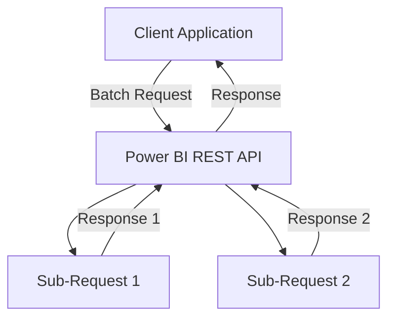

# Demostration: How to Use Power BI REST API

Costa Rica

[](https://github.com/)
[brown9804](https://github.com/brown9804)

Last updated: 2025-04-21

----------

> The Power BI REST API provides programmatic access to several Power BI resources, enabling automation and embedding of analytics.

<details>
<summary><b>List of References </b> (Click to expand)</summary>

- [Using the Power BI REST APIs](https://learn.microsoft.com/en-us/rest/api/power-bi/)
- [Reports - Get Report](https://learn.microsoft.com/en-us/rest/api/power-bi/reports/get-report)
- [Reports Operations](https://learn.microsoft.com/en-us/rest/api/power-bi/reports)
- [Datasets Operations](https://learn.microsoft.com/en-us/rest/api/power-bi/datasets)
- [Get-PowerBIWorkspace](https://learn.microsoft.com/en-us/powershell/module/microsoftpowerbimgmt.workspaces/get-powerbiworkspace?view=powerbi-ps)
- [Admin - Groups GetGroupsAsAdmin](https://learn.microsoft.com/en-us/rest/api/power-bi/admin/groups-get-groups-as-admin)
- [Admin - WorkspaceInfo GetScanResult](https://learn.microsoft.com/en-us/rest/api/power-bi/admin/workspace-info-get-scan-result)
- [Push semantic model limitations](https://learn.microsoft.com/en-us/power-bi/developer/embedded/push-datasets-limitations)
- [Enhanced refresh with the Power BI REST API](https://learn.microsoft.com/en-us/power-bi/connect-data/asynchronous-refresh)

</details>

<details>
<summary><b>Table of Contents</b> (Click to expand)</summary>

- [Overview](#overview)
- [How to work around the rate limits](#how-to-work-around-the-rate-limits)
  - [Batch Request](#batch-request)
    - [Example Implementation in Python](#example-implementation-in-python)

</details>

## Overview

> [!IMPORTANT]
> There are rate limits for Power BI REST API endpoints.
> These limits can vary depending on the specific API you're using.
> Make sure to check out the limits section (e.g., [Limitations Admin - WorkspaceInfo GetScanResult](https://learn.microsoft.com/en-us/rest/api/power-bi/admin/workspace-info-get-scan-result#limitations))

| API Endpoint | Rate Limit | Description |
|------------------|----------------|-----------------|
| General API Requests | 120 requests per minute per user | Applies to most general API requests|
| POST Rows Requests (Tables with < 250,000 rows) | 120 requests per minute per dataset | For tables with fewer than 250,000 rows |
| POST Rows Requests (Tables with ≥ 250,000 rows) | 120 requests per hour per dataset | For tables with 250,000 or more rows|
| Admin - GetDatasourcesAsAdmin | 50 requests per hour | Specific to the GetDatasourcesAsAdmin endpoint |
| Specific Endpoints (e.g., Get Report Users) | 200 requests per hour | Applies to certain endpoints like retrieving report users. |

## How to work around the rate limits

> Few stategies below:

| **Strategy**       | **Description**                                                                 | **Implementation**                                                                                       |
|--------------------|---------------------------------------------------------------------------------|----------------------------------------------------------------------------------------------------------|
| **Batch Requests** | Combine multiple operations into a single batch request.                        | Use the `/batch` endpoint to send multiple sub-requests in one HTTP request.                              |
| **Optimize Queries** | Ensure queries are efficient and retrieve only necessary data.                 | Use filters and select specific fields to minimize data retrieval.                                        |
| **Caching**        | Store frequently accessed data to reduce repeated API calls.                    | Implement in-memory or distributed caching systems like Redis or Memcached.                               |
| **Rate Limiting**  | Control the rate at which your application makes API requests.                  | Use libraries or frameworks that support rate limiting to manage request frequency.                       |
| **Retry Logic**    | Handle cases where you hit the rate limit by retrying requests after a delay.   | Implement logic to check for HTTP status code 429 and use the `Retry-After` header to determine retry time.|
| **Parallel Processing** | Distribute API requests over multiple time periods or user accounts.       | Schedule requests to avoid hitting the rate limit for a single user or distribute requests across accounts.|

### Batch Request

> Example of this works:



```json
POST https://api.powerbi.com/v1.0/myorg/$batch
Content-Type: application/json

{
  "requests": [
    {
      "id": "1",
      "method": "GET",
      "url": "/v1.0/myorg/reports/{reportId}/users"
    },
    {
      "id": "2",
      "method": "GET",
      "url": "/v1.0/myorg/reports/{reportId}"
    }
  ]
}
```

#### Example Implementation in Python

```python
import requests

def batch_request(access_token, requests):
    url = "https://api.powerbi.com/v1.0/myorg/$batch"
    headers = {
        "Authorization": f"Bearer {access_token}",
        "Content-Type": "application/json"
    }
    body = {
        "requests": requests
    }
    response = requests.post(url, headers=headers, json=body)
    return response.json()

# Example usage
access_token = "YOUR_ACCESS_TOKEN"
requests = [
    {
        "id": "1",
        "method": "GET",
        "url": "/v1.0/myorg/reports/{reportId}/users"
    },
    {
        "id": "2",
        "method": "GET",
        "url": "/v1.0/myorg/reports/{reportId}"
    }
]

response = batch_request(access_token, requests)
print(response)
```

<!-- START BADGE -->
<div align="center">
  
  <p>Refresh Date: 2025-09-05</p>
</div>
<!-- END BADGE -->
